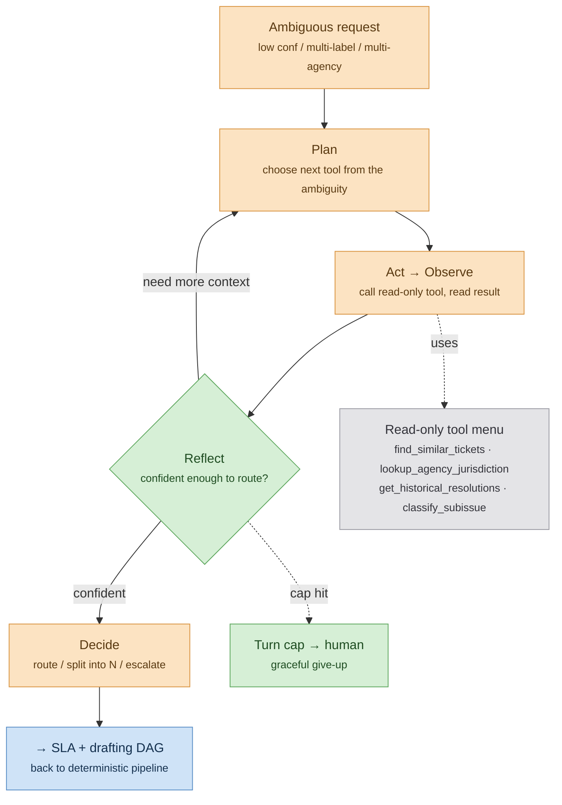

# AI Architecture — FieldOps Copilot

Where AI lives, why each use **earns its place**, how the one agent loop works, how everything is grounded, evaluated, and kept safe. This is the differentiator doc. System-level context: [ARCHITECTURE](ARCHITECTURE.md). Decisions: [ADRs](ADRs.md). Targets: [REQUIREMENTS](REQUIREMENTS.md).

---

## 1. Where AI earns its place

The test, applied per feature. An LLM is allowed **only** when: (a) value is locked in unstructured language/semantics, (b) no deterministic or classical-ML path reaches the bar, and (c) the output is a flag/label/cluster/summary/conversation — **never** a trusted number, query, or side-effecting action.

| Feature | Output | Earns it? | Reasoning |
|---------|--------|-----------|-----------|
| Dedup similarity | Numeric similarity → boolean link | **No LLM** | Embeddings + deterministic threshold. Classical. The *embedding* is ML, but the decision is deterministic. |
| Classifier (cheap tier) | Agency/type label + score | **Borderline → classical first** | An embedding-kNN / cheap classifier handles most; passes only because it's the *cheap* tier of a cascade, not the final word. |
| Classifier (LLM fallback) | Label + calibrated confidence | **Yes** | The residual is genuinely linguistic ("ceiling leak" → DEP vs HPD turns on phrasing). Output is a *label + confidence*, not an action. |
| **Triage agent** | route / split-into-N / escalate **proposal** | **Yes — headline** | Next tool depends on last result; reflection is genuinely fuzzy. Output is a *proposal* that feeds deterministic drafting + a human gate. Must beat a baseline (§5). |
| Work-order drafting | structured draft text | **Yes (single generation)** | Composing actionable prose from a context bundle is linguistic. But inputs are pre-disambiguated → **one generation**, not a loop ([ADR-008](ADRs.md#adr-008)). |
| Validator | pass/fail | **No LLM** | Membership + assertion checks. Deterministic, testable. |
| SLA risk | numeric score | **No LLM** | Tabular ML; an LLM must never emit this number. |
| Resolution summary | summary text | **Yes (generation)** | Linguistic compression; soft output, judge-evaluated. |

Anything not in this table that wants an LLM must first be argued through (a)/(b)/(c) here.

## 2. Provider abstraction

All LLM calls go through one `LLMClient` interface (`complete`, `tool_call`, `embed`) so the provider is swappable ([ADR-003](ADRs.md#adr-003)). Default binding:

| Tier | Model (default binding) | Why |
|------|-------------------------|-----|
| Embeddings | **OpenAI `text-embedding-3`** | dedup + retrieval |
| Cheap classifier fallback | **Groq (groq.com)** | free/low-cost, high throughput on the bulk the classical tier wasn't sure about — the "cheap wherever possible" tier |
| Agent + drafting | **OpenAI (GPT-4-class)** | tool-use + reasoning quality where it matters |
| LLM-judge (eval) | **OpenAI** (different prompt/run); **Groq** as a cost-saving option | scoring generative outputs |

Azure OpenAI is a documented enterprise alternate behind the same interface. *Assumption: OpenAI primary, Groq for the cheap/high-volume tier; swap is config-only.*

## 3. The classification cascade (funnel)

Cost control = **reduce volume before it reaches an expensive model**.

```
ALL tickets
  │  embedding kNN / cheap classifier  (≈ resolves the easy majority, $0-cheap)
  ▼
  ├── confident + single agency ─────────────▶ FAST PATH (no further LLM)
  └── uncertain
        │  Groq classify + calibrate
        ▼
        ├── now confident, single agency ────▶ FAST PATH
        └── still low-conf / multi-label / multi-agency
              ▼
            CONFIDENCE GATE ───▶ AGENT (OpenAI GPT-4-class)   ← only the true tail
```

Only the residual reaches the agent. The **calibrated** confidence (Platt/isotonic on a held-out set — [ADR-007](ADRs.md#adr-007)) is what the gate thresholds on; an uncalibrated score makes the gate meaningless ([NFR-4.1](REQUIREMENTS.md#nfr-4--correctness--calibration)).

## 4. The one agent loop (intake triage)

Source diagram: [fieldops-agent-loop.mermaid](../fieldops-agent-loop.mermaid).



**Entry:** only requests the cascade flags low-confidence, multi-label, or multi-agency. The easy majority never enters.

**Why it's genuinely agentic — the next tool depends on the last:** a descriptor implying both a plumbing leak and a structural hazard → `find_similar_tickets` returns mixed precedents → agent infers two sub-issues → `lookup_agency_jurisdiction` for each → discovers split ownership → decides **split vs. escalate** → reflects: "confident enough to route, or one more lookup?" That branching isn't knowable in advance. That's planning; the reflection is genuinely fuzzy — unlike a downstream "does this ID exist" check, which is deterministic.

**Tool menu — all read-only:** `find_similar_tickets`, `lookup_agency_jurisdiction`, `get_historical_resolutions`, `classify_subissue`. **No side-effecting tool is ever in the menu** (governing principle).

**Output:** a *proposal* — `route(agency)`, `split([agency,…])`, or `escalate` — that feeds the deterministic drafting DAG and a human gate. The agent never finalizes.

**Production hygiene (required for the "production-grade" claim):**
- Hard **turn cap** with graceful give-up → human ([FR-5.4](REQUIREMENTS.md#fr-5--intake-triage-agent)).
- Full **per-turn tracing** to `agent_trace` ([ARCHITECTURE §5](ARCHITECTURE.md#5-data-model-folded-in)).
- Structured **tool-arg validation** before every call.
- **Idempotency** keyed on `routing_decision_id`.
- A dedicated **eval set** (§5).

## 5. Evaluation

Split by task type — *that the eval is split this way is itself the senior signal.* Targets are pinned as NFRs in [REQUIREMENTS §NFR-4](REQUIREMENTS.md#nfr-4--correctness--calibration).

**Discriminative** (classification, routing, dedup, SLA): score against existing 311 labels / computed outcomes ([ADR-006](ADRs.md#adr-006)). Precision/recall/**F1**, **calibration curves + ECE**, confusion analysis. Unit-testable. Dedup uses a few hundred hand-labeled pairs as ground truth.

**Generative** (work-order draft, resolution summary): **lead with deterministic hard checks** — cited-precedent-ID membership in the context bundle, agency match to routing, required fields present — *then* an LLM-judge rubric (actionability, grounding), *then* a human spot-check. **Report judge↔human agreement rate** so the soft metric has teeth.

**Agent path — the headline artifact.** The agent is measured on a **baseline ladder** that isolates the *loop* (full protocol in [EVAL-SPEC §5](EVAL-SPEC.md#5-agent-path-eval--the-headline)):
1. **Baseline A:** single classifier call (top label) — no tools, no loop.
2. **Baseline C (the keystone, DR-05):** **fixed retrieval + one structured call** — the *same* tools/context the agent gets, fetched once, no loop. The ship gate is **(agent − C)**: beating A only shows retrieval helps; beating C shows the *loop* helps.
3. **Baseline B:** "escalate all low-confidence to a human" — a **cost/coverage reference, not a correctness comparator** (it abstains; DR-03).

Metrics: routing **correctness** + **set-based** split metrics (Jaccard / exact-match), abstention scored separately, **turn-count**, **give-up rate**, **cost/latency per resolution**, and **trace assertions**. Agent-specific ground truth is an **adjudicated** route/split/escalate gold set (DR-04), not reused 311 labels. **If it can't beat Baseline C with a 95%-CI lower bound > 0, keep the fixed workflow and cut the loop** — the project's central empirical bet ([PRD R3](PRD.md#7-risks)).

**Operational:** end-to-end latency, **cost per path** (fast vs. agent tail), human override rate, failed/abandoned agent steps, retry counts. Surfaced on the Streamlit dashboard.

## 6. Safety, guardrails & red-team

Standing guardrails (always-on, [FR-10](REQUIREMENTS.md#fr-10--guardrails)) — distinct from the red-team study that *probes* them.

**Input guardrails (before any external LLM call):**
- **PII redaction ([FR-10.1](REQUIREMENTS.md#fr-10--guardrails)).** 311 free text carries addresses, sometimes names/phone numbers. It is detected and redacted **before** it reaches OpenAI/Groq or any trace/log — no raw PII leaves the boundary ([NFR-8.4](REQUIREMENTS.md#nfr-8--privacy--fairness), [OBSERVABILITY §8](OBSERVABILITY.md#8-logging-retention--data-protection)). This is a hard requirement given two third-party providers.
- **Instruction/data separation + injection defense ([FR-10.4](REQUIREMENTS.md#fr-10--guardrails)).** Ticket text and tool results are *data*, never instructions: delimited/spotlighted in the prompt, with injection heuristics flagging "ignore previous instructions"-style payloads. The system prompt states the separation explicitly.

**Output guardrails (before any value is used):**
- **Structured-output enforcement ([FR-10.3](REQUIREMENTS.md#fr-10--guardrails)).** The classifier's and agent's `agency` must be a member of the valid agency enum; the agent's `split into N` is **bounded** (N ≤ cap) so a hijacked or confused agent can't fan out unboundedly. Invalid outputs are rejected pre-use, not trusted.
- **Malformed-output fallback ([FR-10.5](REQUIREMENTS.md#fr-10--guardrails)).** Unparseable classifier output is treated as low-confidence → gate/human, never silently routed.
- **Draft validator.** Rejects any draft citing a precedent not in its bundle or an agency mismatching the routing — catching a hallucinated or manipulated draft before the human sees it ([ADR-008](ADRs.md#adr-008)).

**Structural backstops:**
- **Read-only blast radius.** Even a fully hijacked agent can only call read-only tools; it cannot route-and-submit. The human gate + deterministic submit are the final backstop ([NFR-5.2](REQUIREMENTS.md#nfr-5--security--safety)).
- **Spend/concurrency circuit breaker ([FR-10.2](REQUIREMENTS.md#fr-10--guardrails)).** A runaway loop across many tickets is bounded by a hard daily ceiling + concurrency cap ([OBSERVABILITY §6](OBSERVABILITY.md#6-cost-observability--spend-circuit-breaker)).

**Red-team study (named deliverable — probes the above, [FR-8.6](REQUIREMENTS.md#fr-8--evaluation--observability)):** (1) prompt-injection via malicious ticket text surfacing in tool results; (2) adversarial descriptions crafted to force mis-routing; (3) robustness to typos / truncation / non-English. Document **what broke and the mitigation** ([PRD R6](PRD.md#7-risks), [EVAL-SPEC §9](EVAL-SPEC.md#9-red-team--robustness-eval)).

## 7. Fairness & governance

Anything analyzing reports about people needs an explicit posture.

- **The audit:** join Census/ACS at **tract level** to test whether SLA risk / auto-priority differs by borough or income **for the same complaint type**. Report the disparity, or — if the join isn't built — **downgrade the claim, don't checkbox it** ([PRD R8](PRD.md#7-risks)).
- **Named caveat:** the **ecological fallacy** — tract-level income is not individual income; conclusions are about areas, not people. Stated in the audit, not buried.
- **Suppression / minimums:** no fairness statistic reported on a cell below a minimum sample size (avoid spurious disparity from small N).
- **Won't-build list (governance):**
  - No model that prioritizes or deprioritizes a *person* — only complaint-type/agency routing.
  - No LLM-emitted SLA number or priority decision.
  - No autonomous submission; no side-effecting agent tool.
  - No surveillance feature inferring attributes of individual reporters.
  - No fabricated city integration; the simulated sink is disclosed ([ADR-005](ADRs.md#adr-005)).

## 8. Cost & telemetry

The cascade + confidence gate are the cost-control mechanism: only the tail pays for the agent. Every LLM call logs tokens + cost to `agent_trace` / `routing_decision`; the dashboard shows **cost per path** and total spend, enforcing [NFR-2](REQUIREMENTS.md#nfr-2--cost). The cost ceiling is not just configurable but **enforced** by the spend circuit breaker ([FR-10.2](REQUIREMENTS.md#fr-10--guardrails), [NFR-5.4](REQUIREMENTS.md#nfr-5--security--safety)). Full operational treatment — drift monitoring, SLO alerting, the override→label feedback loop — is in [OBSERVABILITY](OBSERVABILITY.md); the offline correctness protocol is in [EVAL-SPEC](EVAL-SPEC.md).
