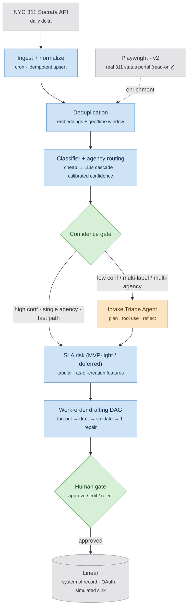
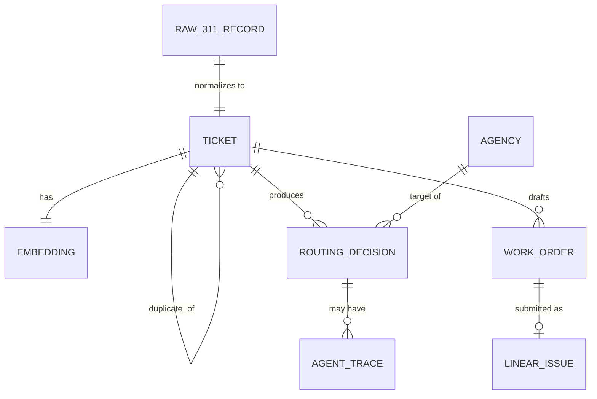

# Architecture — FieldOps Copilot

The *how*, at system level. For the AI-specific design (the agent loop, cascade, evaluation, safety) see [AI-ARCHITECTURE](AI-ARCHITECTURE.md). For decisions and their alternatives see [ADRs](ADRs.md). Quantified targets live in [REQUIREMENTS](REQUIREMENTS.md).

---

## 1. Design tenets

1. **Deterministic by default.** A pipeline stage is an LLM/agent only where the [governing principle](README.md#governing-principle) demands it.
2. **The agent reasons; deterministic code and humans act.** No side-effecting tool is ever in the agent's menu; submission is gated.
3. **Confidence is a first-class output.** The classifier emits a *calibrated* score; the whole architecture branches on it ([ADR-007](ADRs.md#adr-007)).
4. **Idempotent everywhere.** Re-ingesting a 311 record, re-running the agent, or re-submitting a work order must not double-write (`NFR-3.2`).
5. **Everything is traced.** Per-stage and per-agent-turn traces are not optional; they are how we debug and how we prove the agent earns its place.

## 2. High-level architecture

Blue = deterministic · amber = the one agent loop · green = human/decision · grey = external/deferred. Source: [fieldops-architecture.mermaid](../fieldops-architecture.mermaid).



A daily cron pulls the 311 delta; each record is normalized and idempotently upserted, deduplicated, then classified into an agency with a calibrated confidence. The **confidence gate** is the architectural fork: the easy majority takes the deterministic fast path; only the low-confidence / multi-label / multi-agency tail enters the **single agent loop**. Both paths reconverge into the deterministic work-order drafting DAG, which produces drafts a human approves before deterministic submission to Linear.

## 3. Components

| Component | Responsibility | Tech | Key behavior |
|-----------|----------------|------|--------------|
| **Ingest + normalize** | Pull 311 delta, map to canonical schema, idempotent upsert. | Python, Socrata SODA (app token), cron. | Watermark on `created_date`; upsert by `unique_key`. Re-runs are safe. |
| **Dedup** | Link near-identical reports to a canonical ticket. | pgvector cosine + geo (PostGIS-style distance) + time window. | Deterministic threshold; emits `duplicate_of` link, never deletes. |
| **Classifier + routing** | Agency + complaint-type label with **calibrated** confidence. | Cascade: embedding/cheap model → Groq (cheap tier) → (rare) OpenAI. See [AI-ARCH §3](AI-ARCHITECTURE.md#3-the-classification-cascade-funnel). | Calibrated via Platt/isotonic on a held-out set ([ADR-007](ADRs.md#adr-007)). |
| **Confidence gate** | Route fast-path vs. agent. | Threshold on calibrated score + multi-label/multi-agency flags. | The fork; tuned on the reliability curve ([ADR-002](ADRs.md#adr-002)). |
| **Intake triage agent** | Resolve the ambiguous tail; decide route / split / escalate. | **LangGraph** loop, read-only tools, OpenAI GPT-4-class ([ADR-004](ADRs.md#adr-004)). | Turn cap → graceful give-up to human. Detailed in [AI-ARCH §4](AI-ARCHITECTURE.md#4-the-one-agent-loop-intake-triage). |
| **SLA risk** *(MVP-light/deferred)* | Priority/risk score from as-of-creation features. | XGBoost/LightGBM, tabular. | Leakage discipline (PRD R5). May be a stub returning `null` in MVP. |
| **Work-order drafting DAG** | Turn a routed ticket into a grounded draft order. | Fan-out read-only context tools → one structured LLM generation → deterministic validator → ≤1 repair. | Not an agent ([ADR-008](ADRs.md#adr-008)). |
| **Human gate** | Approve / edit / reject. | FastAPI + Streamlit/React review UI. | Nothing reaches Linear without it. |
| **Linear submit** | Create the work order in the system of record. | Linear GraphQL + OAuth. | Idempotency key = ticket id + draft hash. Simulated sink ([ADR-005](ADRs.md#adr-005)). |
| **Observability** | Traces, metrics, eval dashboard. | LangSmith / OpenTelemetry + Streamlit. | Per-stage + per-turn spans; cost per path. |

## 4. Key flows

**Fast path (easy majority):**
`delta → normalize → upsert → dedup(miss) → classify (conf ≥ gate, single agency) → [SLA-light] → drafting DAG → human gate → Linear`. One classifier resolution + one drafting generation. Target p95 in [NFR-1.1](REQUIREMENTS.md#nfr-1--latency).

**Agent path (ambiguous tail):**
`… → classify (conf < gate OR multi-label/agency) → AGENT loop → {route | split into N | escalate} → [SLA-light] → drafting DAG (per resulting ticket) → human gate → Linear`. Detailed loop in [AI-ARCH §4](AI-ARCHITECTURE.md#4-the-one-agent-loop-intake-triage).

**Dedup write→read:** a new report embeds, queries pgvector for neighbors within geo+time window; on a match above threshold it writes a `duplicate_of` edge and increments the canonical ticket's `report_count`; downstream stages operate on canonical tickets only.

## 5. Data model (folded in)

Single store: **Postgres + pgvector** for the MVP ([ADR-010](ADRs.md#adr-010)). Core entities:



| Entity | Key fields | Notes |
|--------|-----------|-------|
| `raw_311_record` | `unique_key` (PK), full Socrata payload (jsonb), `ingested_at`. | Immutable landing copy; enables replay. |
| `ticket` (canonical) | `id` (PK), `unique_key` (FK), `complaint_type`, `descriptor`, `borough`, `geo` (lat/lng), `created_date`, `closed_date`, `report_count`, `duplicate_of` (self-FK, nullable), `status`. | The unit everything downstream operates on. 311 labels retained as ground truth ([ADR-006](ADRs.md#adr-006)). |
| `embedding` | `ticket_id` (FK), `vector(N)`, `model`, `created_at`. | pgvector; indexed (see §indexing). |
| `routing_decision` | `id`, `ticket_id`, `predicted_agency`, `predicted_type`, `confidence_calibrated`, `path` (`fast`\|`agent`), `gate_version`, `created_at`. | Audit of every routing call; `path` powers cost/quality dashboards. |
| `agent_trace` | `id`, `routing_decision_id`, `turn_no`, `tool`, `tool_args` (jsonb), `tool_result` (jsonb), `reflection`, `decision`, `tokens`, `cost`. | One row per agent turn — the debugging + proof artifact. |
| `work_order` | `id`, `ticket_id`, `draft` (jsonb: owner, next_action, due_date, cited_precedent_id), `validator_status`, `repair_count`, `review_status`, `draft_hash`. | `draft_hash` is the idempotency key for submission. |
| `linear_issue` | `work_order_id`, `linear_id`, `submitted_at`. | Simulated sink record. |
| `agency` | `code` (PK), `name`, `jurisdiction` (jsonb). | Reference for `lookup_agency_jurisdiction`. |

**Indexing & partitioning (demo → scale):**
- pgvector **HNSW** index on `embedding.vector` for ANN dedup/`find_similar_tickets`.
- B-tree on `ticket(borough, created_date)` for the daily-delta + dedup window scan.
- At scale: partition `ticket` and `raw_311_record` by month on `created_date`; the access pattern (recent window for dedup, trailing 12 months for eval) is partition-friendly.

## 6. Lifecycle (folded state machine)

A ticket's status is a small, explicit state machine:

```
INGESTED ──dedup hit──▶ DUPLICATE (terminal; linked to canonical)
   │ dedup miss
   ▼
CLASSIFIED ──conf ≥ gate, single agency──▶ ROUTED ─┐
   │ conf < gate / multi-label / multi-agency       │
   ▼                                                 │
IN_TRIAGE ──agent decides route/split──▶ ROUTED ────┤
   │ turn cap hit                                    │
   ▼                                                 ▼
ESCALATED (human queue) ─────────▶ ROUTED ──▶ DRAFTED ──human gate──▶ APPROVED ──submit──▶ SUBMITTED
                                                  │ reject
                                                  ▼
                                               REJECTED (terminal)
```

Precedence: a dedup hit short-circuits to `DUPLICATE` before classification. A `split` produces N child tickets, each entering at `ROUTED`. `ESCALATED` always converges back through a human, never auto-resolves.

## 7. Failure modes & degradation

| Tier down | What breaks | Degradation posture |
|-----------|-------------|---------------------|
| Socrata API | No new delta | Pipeline idles; last watermark holds; retries with backoff. Backfill still queryable. |
| LLM provider | Classifier cascade + agent + drafting | **Provider-agnostic interface** ([ADR-003](ADRs.md#adr-003)) fails over to alternate; if all down, tickets queue at `CLASSIFIED`/`IN_TRIAGE` for replay — nothing lost (idempotent). |
| pgvector / Postgres | Dedup + retrieval + all writes | Hard dependency; circuit-break ingest, alert. No partial writes (transactions). |
| Agent over turn cap | Single ambiguous ticket | **Graceful give-up → human queue** with partial trace. By design, not a failure. |
| Validator fails twice | One draft | Order is *not* submitted; flagged to human with validator errors. Fail closed. |
| Linear API | Submission | Approved orders queue with idempotency key; retried; no double-create on replay. |

## 8. Cross-cutting

- **Security/secrets:** Socrata app token, LLM keys, Linear OAuth in a secret store (env/secret manager); never in traces. Linear via OAuth, least-scope.
- **Idempotency:** upsert by `unique_key`; agent runs keyed by `routing_decision_id`; submission keyed by `draft_hash` (`NFR-3.2`).
- **Consistency:** strong within Postgres transactions; the pipeline is eventually consistent stage-to-stage (a ticket progresses through statuses), which is acceptable for a batch-tolerant intake workflow.
- **Config:** gate threshold, turn cap, cascade model tiers, and provider are config-driven (no redeploy to retune the gate).
- **Scale & capacity:** demo-scale now; the numbers and headroom math live in [REQUIREMENTS §3](REQUIREMENTS.md#3-capacity-sizing). The cascade + confidence gate are the cost-control mechanism that makes scale affordable ([NFR-2](REQUIREMENTS.md#nfr-2--cost)).
